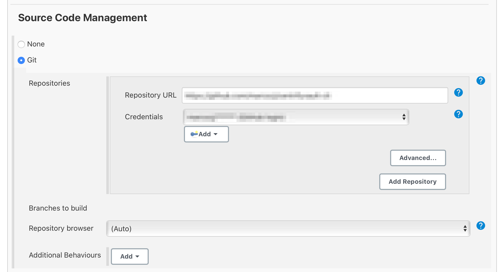
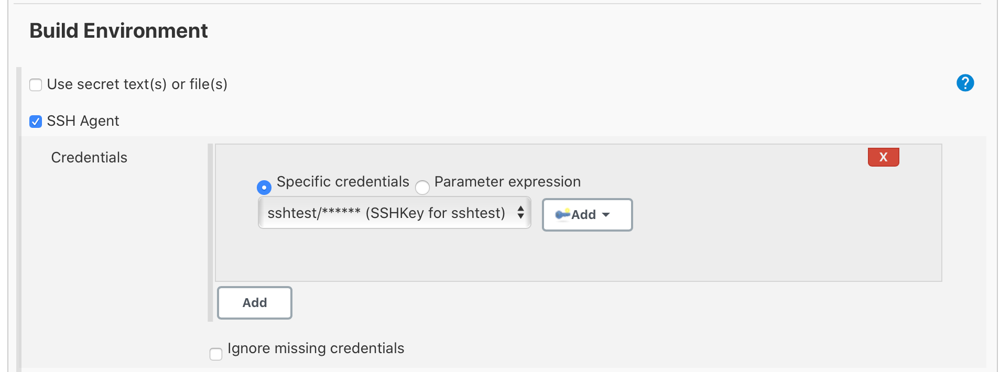
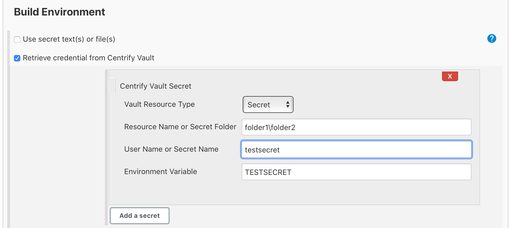

# Jenkins Centrify Vault Plugin

## Introduction

This plugin adds a build wrapper to set environment variables and also extends Jenkins Credentials Plugin to provide credentials stored in Centrify Vault to Jenkins jobs. It injects retrieved credentails from Centrify Vault into build freestyle and pipeline project.

## Getting started

The plugin is packaged in self-contained **.hpi** file which can be installed via Jenkins web UI or CLI.
Refer to [Managing Plugins](https://www.jenkins.io/doc/book/managing/plugins/) for details of how to intall the plugin.

## Configuration

Before the plugin can be used, it must be configured to connect to Centrify Vault. Currently, configuration is done at global level at **Manage Jenkins > Configure System**.

* **Tenant URL** - Centrify tenant or on-prem PAS URL.
* **OAuth App ID** - OAuth application ID configured in Centrify Vault web app.
* **OAuth Scope** - OAuth scope configured in Centrify Vault web app.
* **Client Credentials** - Select a username/password credential that is used to authenticate against Centrify Vault.
* **Enable Debugging** - Turn on debug logging.

Click **Test Connection** to make sure connection is successful.


To configure client credential, navigate to **Manage Jenkins > Manage Credentials** and add a **Username with password** credential.

## Centrify Credentials

The plugin provides 3 kinds of credentials for used by Jenkins jobs.

* **Centrify Vault Secret Text**
  * **Parent Path** - The path of secret in Centrify Vault. Leave it blank if the secret is located at the root level.
  * **Secret Name** - The name of secret.
  * **ID** - ID of this credential. A UUID will be generated if it is not set. It is referred by **credentialsId** in binding so it helps to set it if you want to use the credential inside pipeline script or Jenkinsfile.
  * **Description** - Description of the credential. It is appended to credential display name so it is recommended to provide a meaningful description.
Click **Verify Credential** to verify that the credential exits in Centrify Vault.


* **Centrify Vault Username with Password**
  * **Resource Type** - The type of resource. It corresponds to System, Domain and Database resource in Centrify Vault.
  * **Resource Name** - The name of the resource in Centrify Vault.
  * **User Name** - The local account belongs to the resoure whose password is to be retrieved.
Click **Verify Credential** to verify that the vaulted account exits in Centrify Vault.


* **Centrify Vault Username with SSH Key**
  * **This SSH Key is associated with vaulted account** - In Centrify Vault, a SSH key can be vaulted standalone or associated with account(s). If this is checked, **Resource Name** and **User Name** fields must be provided.
  * **Resource Name** - The name of the resource which has vaulted account with SSH Key.
  * **SSH Key Name** - The name of SSH Key in Centrify Vault.
  * **User Name** - The local account belongs to the resoure whose SSH key is to be retrieved.
  * **Passphrase** - If the SSH key is protected by passphrase, enter here.
Click **Verify Credential** to verify that either vaulted account or SSH key exits in Centrify Vault.


## Plugin Usage

### Usage in FreeStyle Project

When you have certain plugins (such as Git, SSh Agent, etc.) that can make use of Jenkins Credentials Plugin, they can use credentials configured in Jenkins.
For example, Git uses vaulted Git account credential.


For example, SSh Agent uses vaulted SSH key.


Credential stored in Centrify Vault can also be injected into build envrionment variable. When **Retrieve credential from Centrify Vault** is checked, you can add vaulted account password or secret.
    ***Vault Resource Type** - The type of resource. It corresponds to System, Domain, Database and Secret resource in Centrify Vault.
    ***Resource Name or Secret Folder** - The name of the resource if resource type is System, Domain or Database. Or the folder path if resource type is Secret.
    ***User Name or Secret Name** - The local account belongs to the resoure or the secret name.
    ***Environment Variable** - The name of environment variable that holds the injected credential.



### Usage in Pipeline Project

Because the plugin extends Jenkins Credentials Plugin, credentials can be bound to environment variables for use from miscellaneous build steps. Following can be used in pipeline script.

```pipeline script
withCredentials([centrifyVaultUsernamePassword(credentialsId: 'sql-dbadmin', usernameVariable: 'USERNAME', passwordVariable: 'PASSWORD')]) {
    // available as an env variable, but will be masked if you try to print it out any which way
    // note: single quotes prevent Groovy interpolation; expansion is by Bourne Shell, which is what you want
    sh 'echo $PASSWORD'
    // also available as a Groovy variable
    echo USERNAME
    // or inside double quotes for string interpolation
    echo "username is $USERNAME"
}

```pipeline script
withCredentials([centrifyVaultSecretText(credentialsId: 'my-secret', secretVariable: 'SECRET')]) {
    sh 'echo $SECRET'
    echo "secret is $SECRET"
}
```

```pipeline script
withCredentials([centrifyVaultUsernameSSHKey(credentialsId: 'my-sshkey', usernameVariable: 'USERNAME', privatekeyVariable: 'PRIVATEKEY' )]) {
    echo "usename is $USERNAME"
    echo "private key is $PRIVATEKEY"
}
```

## Contributing

TODO review the default [CONTRIBUTING](https://github.com/jenkinsci/.github/blob/master/CONTRIBUTING.md) file and make sure it is appropriate for your plugin, if not then add your own one adapted from the base file

Refer to our [contribution guidelines](https://github.com/jenkinsci/.github/blob/master/CONTRIBUTING.md)

## LICENSE

Licensed under MIT, see [LICENSE](LICENSE.md)

