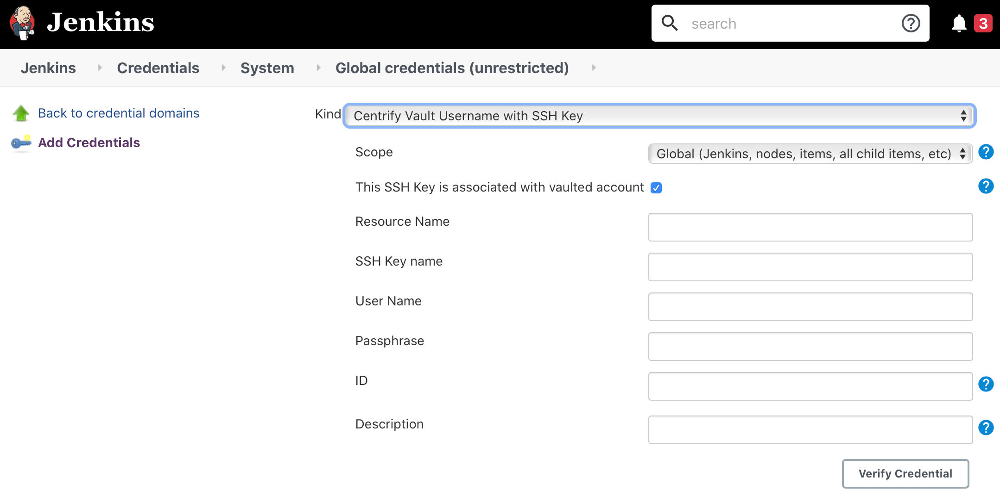

# Jenkins Centrify Vault Plugin

## Introduction

This plugin extends Jenkins Credentials Plugin to provide credentials stored in Centrify Vault to Jenkins jobs. It injects retrieved credentails from Centrify Vault into build freestyle and pipeline project.

## Getting started

The plugin is packaged in self-contained **.hpi** file which can be installed via Jenkins web UI or CLI.
Refer to [Managing Plugins](https://www.jenkins.io/doc/book/managing/plugins/) for details of how to intall the plugin.

## Configuration

Before the plugin can be used, it must be configured to connect to Centrify Vault. Currently, configuration is done at global level at **Manage Jenkins > Configure System**.

* **Tenant URL** - Centrify tenant or on-prem PAS URL.
* **OAuth App ID** - OAuth application ID configured in Centrify Vault web app.
* **OAuth Scope** - OAuth scope configured in Centrify Vault web app.
* **Client Credentials** - Select a username/password credential that is used to authenticate against Centrify Vault.
* **Enable Debugging** - Turn on debug logging.

Click **Test Connection** to make sure connection is successful.

To configure client credential, navigate to **Manage Jenkins > Manage Credentials** and add a **Username with password** credential.

## Centrify Credentials

The plugin provides 3 kinds of credentials for used by Jenkins jobs.

* **Centrify Vault Secret Text**
  * **Parent Path** - The path of secret in Centrify Vault. Leave it blank if the secret is located at the root level.
  * **Secret Name** - The name of secret.
  * **ID** - ID of this credential. It is referred by **credentialsId** in binding.
  * **Description** - Description of the credential. It is appended to credential display name so it is recommended to provide a meaningful description.
Click **Verify Credential** to verify that the credential exits in Centrify Vault.

* **Centrify Vault Username with Password**
  * **Resource Type** - The type of resource. It corresponds to System, Domain and Database resource in Centrify Vault.
  * **Resource Name** - The name of the resource in Centrify Vault.
  * **User Name** - The local account belongs to the resoure whose password is to be retrieved.
Click **Verify Credential** to verify that the vaulted account exits in Centrify Vault.

* **Centrify Vault Username with SSH Key**
  * **This SSH Key is associated with vaulted account** - In Centrify Vault, a SSH key can be vaulted standalone or associated with account(s). If this is checked, **Resource Name** and **User Name** fields must be provided.
  * **Resource Name** - The name of the resource which has vaulted account with SSH Key.
  * **SSH Key Name** - The name of SSH Key in Centrify Vault.
  * **User Name** - The local account belongs to the resoure whose SSH key is to be retrieved.
  * **Passphrase** - If the SSH key is protected by passphrase, enter here.
Click **Verify Credential** to verify that either vaulted account or SSH key exits in Centrify Vault.

## Plugin Usage

## Contributing

TODO review the default [CONTRIBUTING](https://github.com/jenkinsci/.github/blob/master/CONTRIBUTING.md) file and make sure it is appropriate for your plugin, if not then add your own one adapted from the base file

Refer to our [contribution guidelines](https://github.com/jenkinsci/.github/blob/master/CONTRIBUTING.md)

## LICENSE

Licensed under MIT, see [LICENSE](LICENSE.md)

